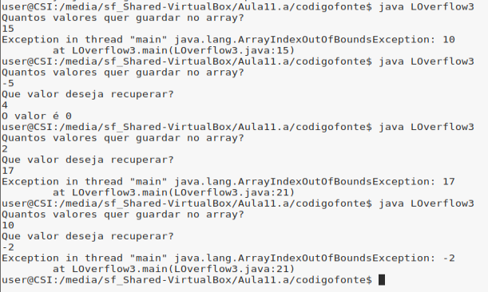
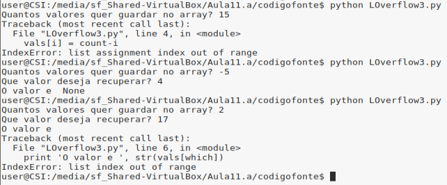
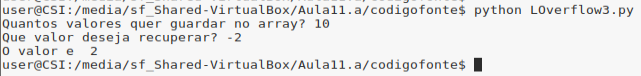
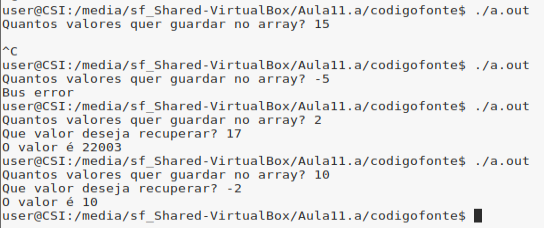
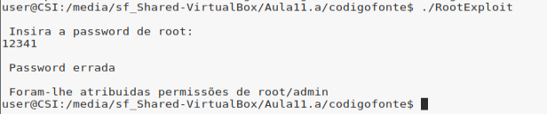
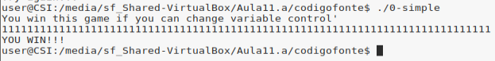
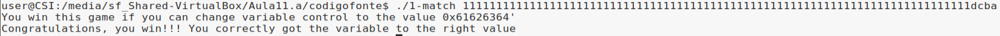
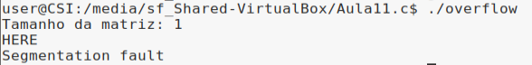

# Trabalho Prático 8 - 29/Abr/2019

## 1. Buffer Overflow

### Pergunta P1.1 - Buffer overflow em várias linguagens

TODO: Mafalda

### Pergunta P1.2 - Buffer overflow em várias linguagens

O programa `LOverflow3` tem o seguinte algoritmo:

1. Inicializa um *array*/lista `vals` de inteiros com um tamanho de 10.
2. Lê um número `count` que determina a quantidade de valores que será guardado no *array*.
3. Preenche `vals` com o `count` elementos.
4. Lê um número `which` e imprime o valor `vals[which]`.

No caso do programa em Java, a proteção interna contra ataques de *buffer overflow* faz com que quaisquer tentativas de acesso à memória exterior a `vals` resulte no levantamento de uma exceção:




No caso do programa em Python, não é possível obter dados exteriores aos limites da lista. Ainda assim, é possível extrair valores de defeito em casos nos quais a lista não é preenchida por completo, bem como instruir o programa a preencher a lista por ordem inversa:







No caso do programa em C++, devido à falta de mecanismos de proteção contra este tipo de ataque, é possível explorar o algoritmo de modo a extrair dados exteriores ao *array*: 




### Pergunta P1.3 - Buffer overflow

O programa `RootExploit.c` tem o seguinte algoritmo:

1. Lê uma *password* através da função `gets`.
2. Compara o valor lido com a string `"csi1"`.
3. Se for igual então a variável `pass` ficam com o valor 1.
4. Se `pass` for 1, então tem-se permissões de *root*/*admin*.

O problema reside na utilização da função `gets`, uma vez que esta não verifica o tamanho do input e o compara com o tamanho alocado para a variável que vai armazenar esse *input*. Desta forma, dado que `buff` é um array de 4 posições e a última está ocupado pelo `\0`, apenas se pode introduzir 3 caracteres. No entanto, se o utilizador continuar a escrever o programa continua a escrever para lá dos limites do `buff`.

Assim sendo, se se tiver em conta a organização das variáveis em memória, é possível subverter o comportamento do algoritmo. As variáveis são armazenadas em memória da seguinte forma:

```
    STACK
+----------+ <- Endereço de memória maiores
|   ....   |
+----------+
|   pass   |
+----------+
| buff[4]  |
+----------+
|   ....   |
+----------+ <- Endereço de memória menores
```

Desta forma, se se continuar a escrever no `buff` para além dos seus limites, começa-se a escrever na variável `pass` e a alterar o seu valor. A seguinte figura mostra isso mesmo:



Na prática, a porção do input `123` preencheu as 3 primeiras posições do `buff`. O valor `4` escreveu por cima do `\0` e por fim o último `1` escreveu na variável `pass`. Assim, apesar da `password` estar errada, a variável `pass` ficou a `1` e obteve-se privilégios de *root*/*admin*.

---

O programa `0-simple.c` tem o seguinte algoritmo:

1. A variável `control` é inicializada a `0`.
2. É lida uma *password* através da função `gets`.
3. Se a variável `control` for diferente de `0`, ganha-se.

Da mesma forma, este programa utiliza a função `gets` que não é segura como já foi referido anteriormente. Assim é possível através da variável `buffer` corromper a memória e escrever na variável `control`. As variáveis são armazenadas em memória da seguinte forma:

```
    STACK
+------------+ <- Endereço de memória maiores
|    ....    |
+------------+
|  control   |
+------------+
| endereço?  |
+------------+
| buffer[64] |
+------------+
|    ....    |
+------------+ <- Endereço de memória menores
```

Assim sendo, foi possível explorar a vulnerabilidade oferecida pela função `gets`, da seguinte forma:



A resposta envolve inserir um `input` com um tamanho 77. Os primeiros 64 caracteres servem para encher o array `buffer` inclusive a última posição que é do `\0`. Os próximos 12 caracteres (TODO: acabar). Por fim, o último caractere vai preencher a variável control e torná-la diferente de 0.


> DÚVIDA: 64 bytes (buffer) + 12 bytes => control

bc &control
   endereço?
70 &buffer

### Pergunta P1.4 - Read overflow

TODO: Mafalda

### Pergunta P1.5

O programa `1-match.c` tem o seguinte algoritmo:

1. Lê uma *string* como argumento da linha de comandos durante o arranque do programa.
2. Inicializa a variável *integer* `control` a 0.
3. Copia o argumento da linha de comandos para o *array* `buffer` através da função `strcpy`.
4. Compara o valor da variável `control` com o valor hexadecimal `0x61626364`.
5. Se for igual então o programa mostra uma mensagem `congratulations`.
6. Senão, mostra uma mensagem `try again` e demonstra o valor de `control`.

O problema reside na utilização do método utilizado com o programa `0-simple.c` em conjunto com um conjunto de carateres cujo valor inteiro corresponda a `0x61626364`. Deste modo, é introduzido o argumento na linha de comandos de modo a que este preencha o `buffer` e sobreponha o valor do `control` quando é chamada a função `strcpy`. 

Para tal, verificou-se os valores hexadecimais dos carateres ASCII, determinando-se que os valores `0x61`, `0x62`, `0x63` e `0x64` correspondem aos carateres `a`, `b`, `c` e `d`, respetivamente. Sabendo isto, foi apenas necessário determinar o *endianness* da máquina virtual. Utilizando o próprio programa para tal, observou-se que este guarda os dados no modo *little-endian*, no qual os dados são armazenados por ordem inversa. Como tal, a resposta envolve inserir um argumento de tamanho 80, no qual os últimos 4 carateres são a sequência `dcba`

Assim sendo, foi possível explorar a vulnerabilidade oferecida pelo programa da seguinte forma:



## 2. Vulnerabilidade de inteiros

### Pergunta P2.1

A vulnerabilidade presente na função `vulneravel` está relacionada com a realização de operações com `size_t` (inteiros positivos) sem verificar possíveis situações de *overflow*/*underflow*.

Assim sendo, uma possível execução que origina uma situação de *overflow* é a seguinte:

```c
void vulneravel (char *matriz, size_t x, size_t y, char valor) {
    int i, j;

    matriz = (char *) malloc(x*y);

    printf("HERE\n");

    for (i = 0; i < x; i++) {
        for (j = 0; j < y; j++) {
            matriz[i*y+j] = valor;
        }
    }
}

int main() {
    char *matriz;
    printf("Tamanho da matriz: %zu\n", SIZE_MAX*SIZE_MAX);
    vulneravel(matriz, SIZE_MAX, SIZE_MAX, '1');
    return 0;
}
```

O resultado obtido é o seguinte:



Na prática apenas se aloca espaço para um `char` na variável `matriz` que fica preenchido pelo `\0` por ser uma string. Tendo em conta que o `SIZE_MAX` é o valor máximo que um `size_t` pode tomar, quando no `malloc` se faz `x*y` (`SIZE_MAX*SIZE_MAX`), origina-se um *overflow* e o resultado da operação é 1. No entanto, quando se vai a preencher a `matriz` nos ciclos `for` endereça-se posições para lá dos limites da variável `matriz`, pois as variáveis `x` e `y` são valores enormes.

Por fim, é de salientar que o programa termina em `Segmentation fault` devido ao facto de estar a preencher valores para lá dos limites da `matriz`.

### Pergunta P2.2

TODO: Mafalda

```c
#include <stdio.h>
#include <stdlib.h>
#include <string.h>

const int MAX_SIZE = 2048;


void vulneravel (char *origem, size_t tamanho) {
    size_t tamanho_real;
    char *destino;
    if (tamanho < MAX_SIZE) {
        tamanho_real = tamanho - 1; // Não copiar \0 de origem para destino
        destino = (char *) malloc(tamanho_real);
        printf("%zu\n", tamanho_real);
        memcpy(destino, origem, tamanho_real);
        printf("%s\n", destino);
    }
}

int main() {
    char origem[10] = "MENSAGEM";
    vulneravel(origem, 0);
}
```
