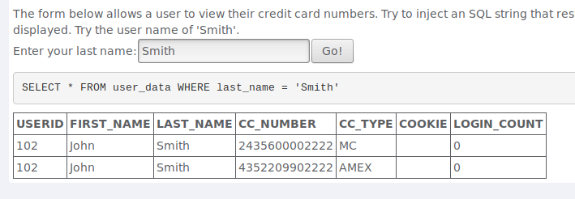
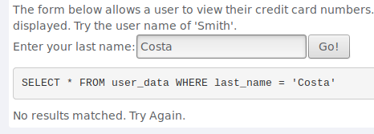
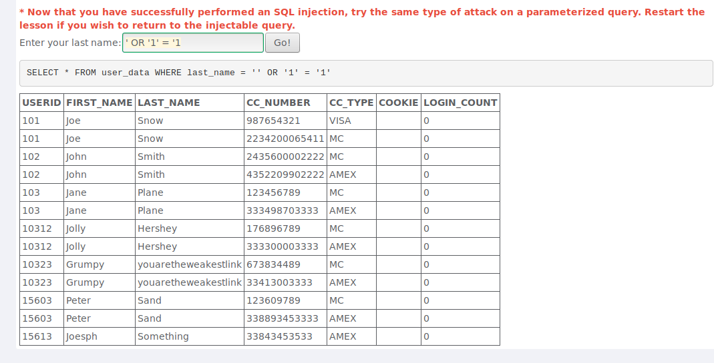
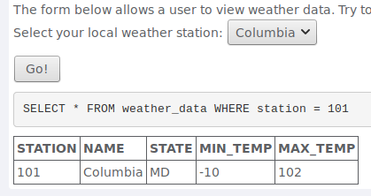
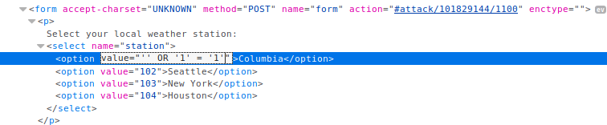
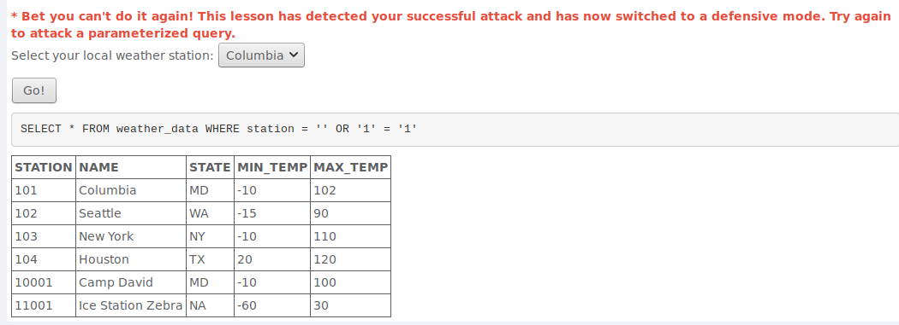
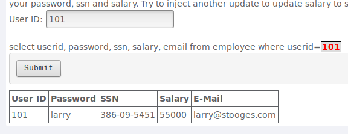
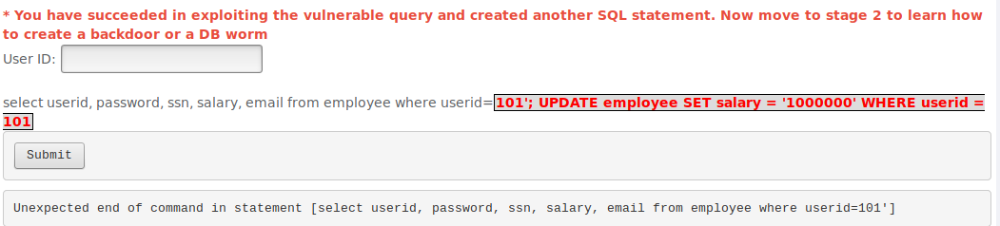
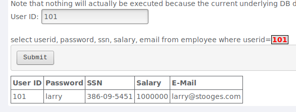

# Trabalho Prático 9 - 06/Mai/2019

## 1. *Injection*

### Pergunta 1.1 - *String* SQL *Injection*

Exemplos de utilização normal:

---

Possível solução para executar o SQL *injection*:

### Pergunta 1.2 - *Numeric* SQL *Injection*

Exemplo de utilização normal:

---

Neste exercício em específico, como se trata de um `form` não é possível através da interface manipular os dados que são submetidos. No entanto, utilizando as ferramentas do próprio *browser* é possível ter acesso ao HTML da página. De seguida, basta modificar o campo `value` de uma das opções disponíveis no *dropdown* (e.g. *Columbia*). Na prática, quando selecionamos uma opção é o valor que está no `value` que é submetido, logo se o modificarmos para o valor `'' or '1'='1'` a condição `WHERE` torna-se uma tautologia.

### Pergunta 1.3 - *Database Backdoors*

Exemplo de utilização normal:

---

Utilizando o comando `UPDATE` do SQL é possível alterar o valor do salário para um número arbitrário. Na prática foi introduzido o seguinte *input*: `101'; UPDATE employee SET salary = '1000000' WHERE userid = 101`.

A submissão da *string* anterior faz com que o salário do utilizador com o ID 101 seja 1000000.

## 2. XSS

### Pergunta 2.1 - *Reflected* XSS

## 3. Quebra na Autenticação

### Pergunta 3.1 - *Forgot Password*
