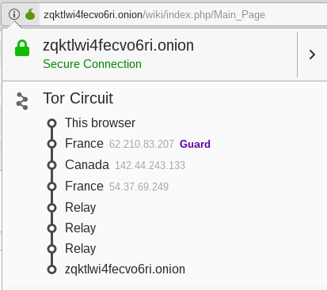

# Trabalho Prático 3 - 25/Fev/2019

## 1. TOR (The Onion Router)

### Pergunta P1.1 - 1/2

Não é possível atribuir ao utilizador uma localização específica (e.g. EUA) através da execução do comando `sudo anonsurf start`. Isto acontece porque, apesar de ser o *Onion Proxy* (OP) que estabelece o circuito através da rede TOR (com base nos dados obtidos do *Directory Server*), este processo é executado de forma aleatória e independente do utilizador. Desta forma, a localização dos vários *Onion Routers* (OR) do circuito não é determinada diretamente pelo utilizador, em particular, o nodo de saída. Este nodo é considerado pelo *website* como sendo o cliente, pelo que só o seu IP e localização são conhecidos. Para todos os efeitos, o servidor *web* considera que estas informações são as do cliente original.

### Pergunta P1.2 - 1

	

Conforme se pode verificar através da imagem anterior, o circuito TOR é constituído por seis OR's, localizando-se os primeiros três em França, Canadá e França, respetivamente, e três OR's de *relay*.
